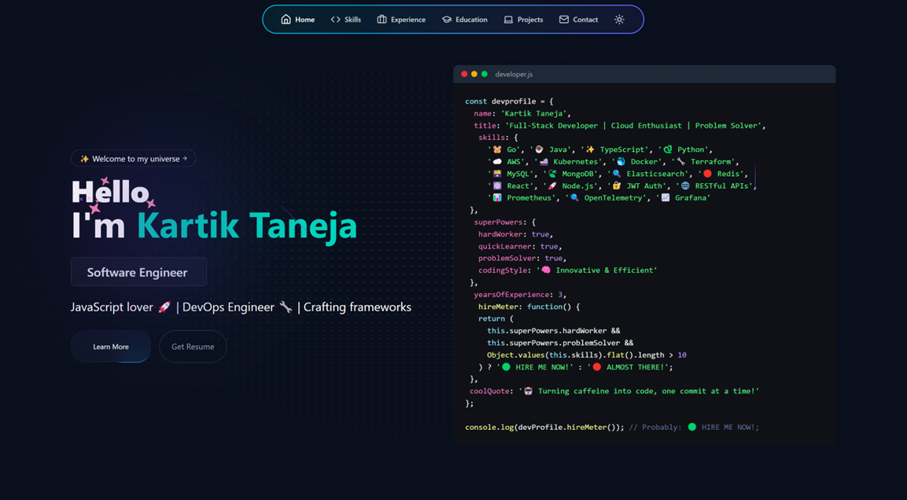

> Welcome to my portfolio website! This site showcases my skills, experience, education, projects, and how to get in touch with me. It's built with React and Vite for a fast, modern web experience. You can explore my work, learn about my journey, and contact me directly.

Check out the live preview of the portfolio website here:
[Live Demo](https://kartiktaneja7.github.io/Portfolio)

Project Structure


## Sections of the Portfolio

The portfolio website consists of the following sections:

---

## 💻 Technologies Used  
- **Frontend**: React.js with Vite (TypeScript)  
- **Styling**: Tailwind CSS  
- **UI Components**: shadcn/ui  
- **Animations**: Framer Motion  
- **Icons**: Lucide React  
- **Deployment**: Vercel  

**About**: Introduction and a brief overview.  
**Skills**: A detailed list of my technical skills.  
**Experience**: My professional journey and work experience.  
**Education**: Academic background and certifications.  
**Projects**: A showcase of the projects I've worked on.  
**Contact**: Information on how to reach out to me.  

---

## Installation ⬇️

You will need to download **Git** and **Node** to run this project.

### Git

- Download and install Git from the official website: [Git Downloads](https://git-scm.com/)
- Verify the installation:
  ```bash
  git --version
  ```

### Node

- Download and install Node.js from the official website: [Node.js Downloads](https://nodejs.org/)
- Make sure you have the latest version of both Git and Node on your computer.
- Verify the installation:
  ```bash
  node --version
  ```

# Getting Started 🎯

### Fork and Clone the Repository 🚀
1. Click the **Fork** button at the top-right corner of the page to create your own copy of the repository.
2. After forking, open your terminal and run the following commands to clone the repo:

  ```bash
  git clone https://github.com/kartiktaneja7/Portfolio.git
  ```
Navigate to the Project Directory 📂
Once the repository is cloned, change your directory to the project folder:
```bash
cd portfolio
```

Install Dependencies ⚙️
From the root directory of your project, install the necessary packages:
```bash
npm install
```

Run the Development Server 🚀
Start the development server to see your project live:
```bash
npm run dev
```

View the Project 🌐
Open your browser and visit http://localhost:5173/ to see the result! 🎉

## 📝 License
This project is licensed under the MIT License - see the LICENSE file for details.


